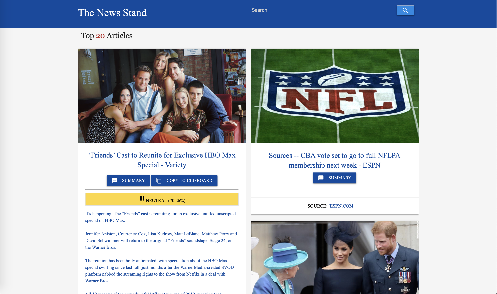
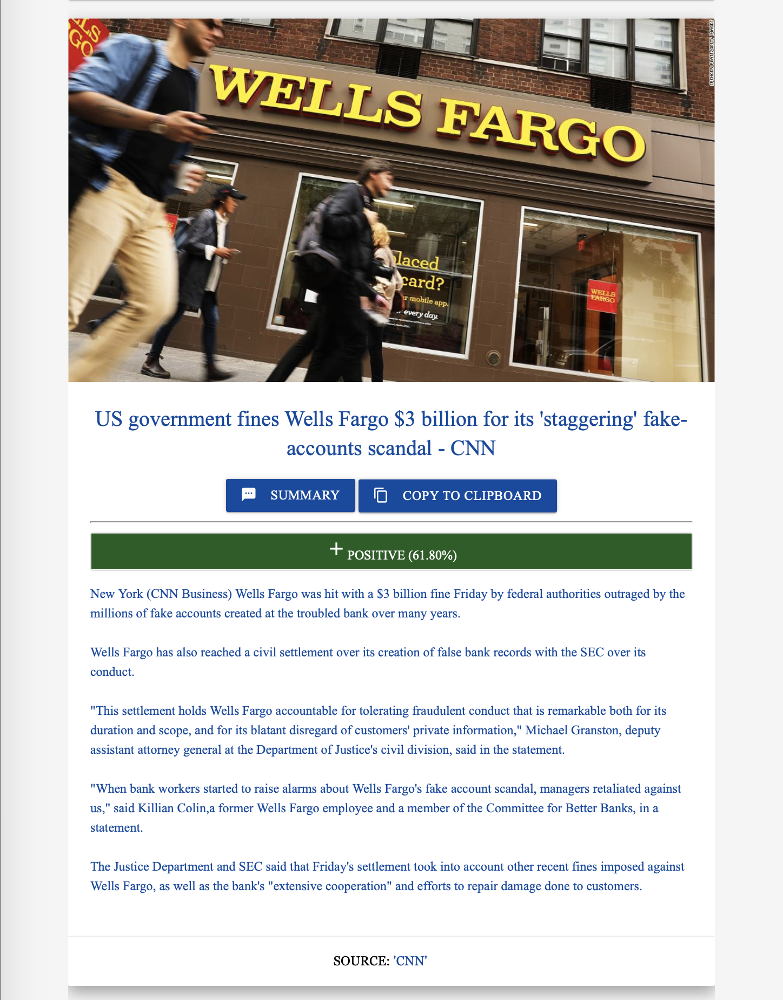

# The News Stand

## Description
A simple, news application that provides summaries and sentiment analysis of articles from a wide variety of sources. 

## How to Play

You can find the application hosted by GitHub pages [here](https://mlfiii.github.io/Week7Project1/). You can search for articles by keywords using the search bar on the top right. Each article has its source shown on the bottom of its card and clicking on the source will take you to the original webpage of the article. 

`
To get a summary of the article as well as its sentiment analysis, click the "SUMMARY" button and the summary and sentiment analysis will load underneath the headline of the article. The sentiment of an article can be one of three things: "POSITIVE" (shown in green), "NEGATIVE" (shown in red), or "NEUTRAL" (shown in yellow). The corresponding confidence value of the analysis will be displayed as a percentage in parentheses next to the sentiment. To copy the generated summary, click the "COPY TO CLIPBOARD" button. 